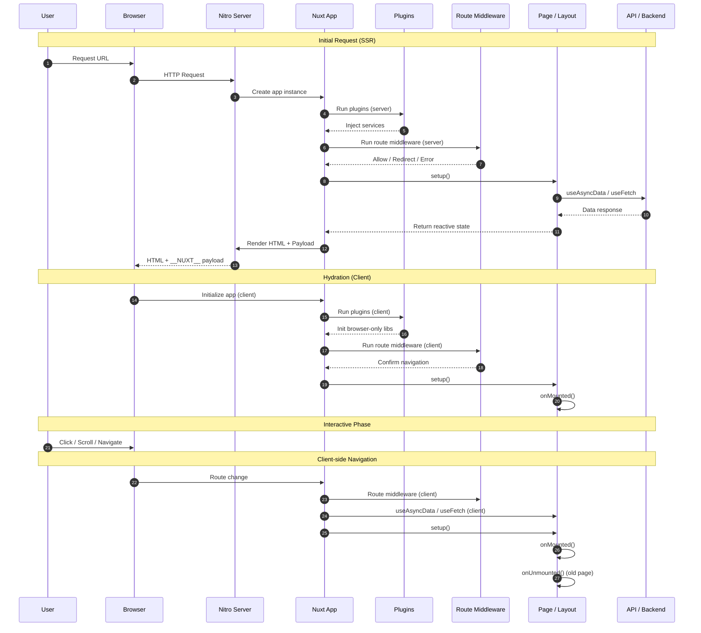

# Nuxt 3 SSR – Lifecycle & Execution Order

Tài liệu này mô tả **vòng đời (lifecycle)** và **thứ tự thực thi** của một Nuxt 3 app chạy **SSR**, kèm theo **mục đích sử dụng & use case thực tế cho từng context**.

---

## 1. Tổng quan SSR trong Nuxt 3

Với mỗi request trang:

1. **Server-side (SSR)**: render HTML + fetch data
2. **Client-side (Hydration)**: gắn event, tương tác UI

> ⚠️ Mỗi page **được khởi tạo mới hoàn toàn trên server** cho mỗi request

---

## 2. Luồng tổng thể (High-level Flow)

```text
Request
 ↓
[Server]
  Plugins
  Route Middleware
  useAsyncData / useFetch
  setup()
  Render HTML + Payload
 ↓
[Client]
  Plugins
  Route Middleware
  setup()
  onMounted()
  Interactive UI
```

---

## 3. Server-side Lifecycle (SSR)

### 3.1 Nitro nhận request

**Context**: Server (Node / Edge)

**Mục đích**:

- Nhận HTTP request
- Match route
- Khởi tạo Nuxt app instance cho request

**Use case**:

- Multi-tenant SSR
- IP-based logic
- Locale detection từ headers

---

### 3.2 Nuxt Plugins (Server)

```ts
export default defineNuxtPlugin(() => {});
```

**Context**: Server

**Dùng để**:

- Inject service (API client, logger)
- Đọc headers, cookies
- Detect locale, country

**Use case thực tế**:

- Inject `$api` có gắn auth token
- Detect Vietnamese IP để block SSR
- Gắn request-id cho logging

---

### 3.3 Route Middleware (Server)

```ts
defineNuxtRouteMiddleware((to, from) => {});
```

**Context**: Server

**Dùng để**:

- Guard route
- Redirect
- Throw error / block access

**Thứ tự**:

1. Global middleware
2. Named middleware
3. Page middleware

**Use case**:

- Auth check
- Geo blocking
- Event on/off control

---

### 3.4 useAsyncData / useFetch (Server)

```ts
const { data } = await useAsyncData("key", () => $fetch("/api"));
```

**Context**: Server

**Dùng để**:

- Fetch data trước khi render HTML
- SEO-friendly
- Embed data vào payload

**Use case**:

- Event detail page
- CMS content
- Banner / campaign data

> ⚠️ Không dùng `onMounted` để fetch data nếu cần SSR

---

### 3.5 Vue setup() (Server)

```ts
setup() {}
```

**Context**: Server (no DOM)

**Dùng để**:

- Khởi tạo state
- Tính toán logic thuần JS

**Không dùng được**:

- window / document
- DOM API

**Use case**:

- Normalize data
- Map API response → UI model

---

### 3.6 Render HTML

**Context**: Server

**Kết quả**:

- HTML
- Payload (`__NUXT__`)

**Use case**:

- SEO
- Faster first paint

---

## 4. Client-side Lifecycle (Hydration)

### 4.1 Nuxt Plugins (Client)

```ts
defineNuxtPlugin(() => {});
```

**Context**: Client (Browser)

**Dùng để**:

- Init third-party libs
- Access window / localStorage

**Use case**:

- Google Analytics
- Firebase
- UI library init

---

### 4.2 Route Middleware (Client – lần đầu)

**Context**: Client

**Dùng để**:

- Re-check route condition
- Sync state client

**Lưu ý**:

- Không fetch lại data nếu đã có SSR payload

---

### 4.3 Vue setup() (Client)

**Context**: Client

**Dùng để**:

- Re-create state
- Prepare reactive logic

---

### 4.4 onMounted()

```ts
onMounted(() => {});
```

**Context**: Client only

**Dùng để**:

- DOM access
- Event listener
- Third-party JS

**Use case**:

- Swiper
- Chart.js
- Scroll / Resize observer

---

## 5. Client-side Navigation (SPA mode)

Khi user chuyển page trong app:

```text
Route Middleware (client)
 → useAsyncData / useFetch (client)
 → setup()
 → onMounted()
 → onUnmounted() (page cũ)
```

**Use case**:

- Filter
- Pagination
- Tab navigation

---

## 6. Bảng tổng hợp lifecycle & context

| Hook / API   | Server | Client | Mục đích chính       |
| ------------ | ------ | ------ | -------------------- |
| Plugin       | ✅     | ✅     | Inject, init service |
| Middleware   | ✅     | ✅     | Guard, redirect      |
| useAsyncData | ✅     | ✅     | Fetch data           |
| setup()      | ✅     | ✅     | Init logic           |
| onMounted    | ❌     | ✅     | DOM / JS libs        |
| onUnmounted  | ❌     | ✅     | Cleanup              |

---

## 7. Các pattern & best practices

### ✅ SSR-safe code

```ts
if (process.client) {
  // window, document
}
```

---

### ❌ Anti-pattern

- Fetch API trong `onMounted` nếu cần SEO
- Access DOM trong `setup`

---

## 8. Khi nào dùng cái gì?

| Nhu cầu       | Nên dùng            |
| ------------- | ------------------- |
| SEO           | useAsyncData        |
| Block user    | Middleware (server) |
| Init JS lib   | onMounted           |
| Global config | Plugin              |

---

## 9. Gợi ý mở rộng

- Sequence diagram (Mermaid)
- Flow SSR fallback / Blank UI
- Case study: Event page + IP blocking

---

## 10. Sequence Diagram – Nuxt 3 SSR Lifecycle

Diagram dưới đây mô tả **thứ tự thực thi đầy đủ** của Nuxt 3 khi render SSR và hydrate client.



---

### Cách đọc diagram (rất quan trọng khi debug SSR)

- **Bên trái → server context**: không DOM, không window
- **useAsyncData chạy trước render HTML** → quyết định SEO
- **onMounted chỉ chạy ở client** → JS lib, DOM
- **Client navigation không đi qua server**

---

### Mapping diagram → use case thực tế

| Giai đoạn        | Use case                |
| ---------------- | ----------------------- |
| Plugins (server) | Detect IP, locale, auth |
| Middleware       | Block event, redirect   |
| useAsyncData     | Fetch event/banner/CMS  |
| Render HTML      | SEO, first paint        |
| Plugins (client) | GA, Firebase            |
| onMounted        | Swiper, Chart, Observer |

---

## 11. "When to use what" – FE Cheat Sheet

Bảng tổng hợp ở [Section 6](#6-bảng-tổng-hợp-lifecycle--context) và [Section 8](#8-khi-nào-dùng-cái-gì) đã tóm tắt khi nào dùng hook/API nào. Để có **cheat sheet chi tiết** (tình huống → dùng gì, plugin vs middleware, checklist SSR), xem trang:

**[Nuxt 3 SSR – When to use what](/nuxt-architecture/nuxt-ssr-when-to-use-what)**

---

**End of document**
